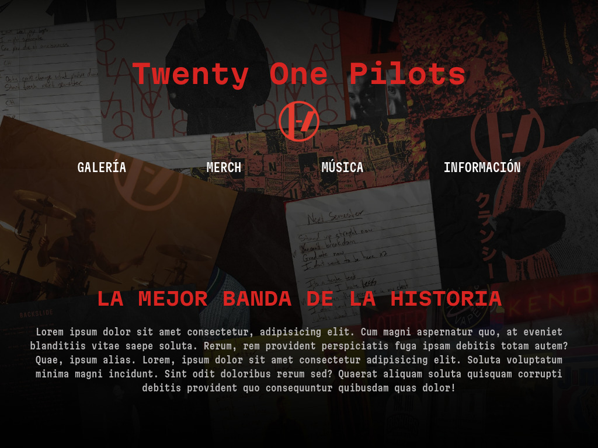

# Pagina-de-Twenty-One-Pilots

Página web dedicada a Twenty One Pilots

# Vista Previa 

# Descripción del Proyecto

Para practicar mis conocimientos en HTML5, CSS3 y JavaScript cree por una página web dedicada a Twenty One Pilots, basandome un poco en el diseño principal de su página web.

# Tecnologías Utilizadas
* **HTML5** Para la estructuración de la página
* **CSS3** Para el diseño, estilos y animación
  * Se utilizo **Flexbox** y **Grid**
  * Se implemento **Media Queries** para un diseño responsivo
* **JavaScript** Para darle dinamismo e interacción a los elementos de la página

# Ver Proyecto en Vivo

Puedes ver el resultado final aquí: [Enlace al proyecto](https://jaredvd.github.io/Pagina-de-Twenty-One-Pilots/)

# Lo que Aprendí

* El uso de JavaScript para la generación de la Galeria de forma dinamica
* El uso de JavaScript para mostrar una imagen de la galería de mayor tamaño al darle click
* El uso de JavaScript para darle más dinamismo al menú de la página
* El uso de JavaScript para llevarte a cada sección de la página dando click a cada opción del menú
* El diferente uso de varios formatos de video e imagen para una mejor optimización de la página

# Auto

* **Jared Vázquez Díaz**
* Github: [@JaredVD](https://github.com/JaredVD)
* LinkedIn [Mi perfil de LinkedIn](https://www.linkedin.com/in/jared-v%C3%A1zquez-d%C3%ADaz/)
